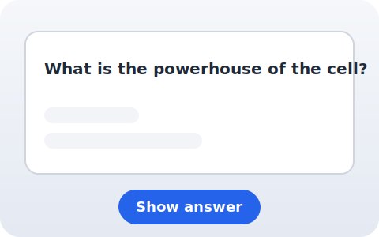
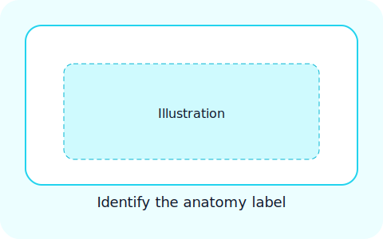

# Anki Deck Viewer

A polished Flask web server that renders flashcards from an exported Anki
collection. The viewer ships with an accessible UI, supports keyboard
navigation, and recognises multiple card layouts so studying feels the same as
inside Anki.

## Features

* Automatic detection of **basic**, **cloze**, and **image** card types.
* Responsive card viewer with keyboard shortcuts and progress indicators.
* Inline image enhancement with loading states and lazy loading.
* Persistent per-deck progress using `sessionStorage` fallbacks.
* JSON API (`/api/cards`) and individual card endpoints for integrations and
  automated checks.

## Supported card types

| Card type | Description | Preview |
| --- | --- | --- |
| Basic | Standard front/back cards rendered with a polished layout. |  |
| Cloze | Cloze deletions with inline reveal controls and hints. |  |
| Image | Image-only cards with automatic media detection. |  |

## Keyboard shortcuts

| Shortcut | Action |
| --- | --- |
| `Space` / click | Flip the current card |
| `→` | Go to the next card |
| `←` | Go to the previous card |
| `R` | Jump to a random card |
| `?` | Toggle the help overlay |
| `Esc` | Close the help overlay |

## Getting started

1. Create a virtual environment and install dependencies:

   ```bash
   python -m venv .venv
   source .venv/bin/activate
   pip install -r requirements.txt
   ```

2. Copy the Anki deck into the `data/` directory located at the root of this
   repository (the file is ignored by Git). The application prefers the
   `MCAT_High_Yield.apkg` filename but also recognises the original export name
   `MCAT High Yield.apkg` (hyphenated variations work as well).

3. Start the server:

   ```bash
   flask --app app run --host 0.0.0.0 --port 5000
   ```

4. Visit <http://localhost:5000> in a browser to browse decks and cards.

The application automatically unpacks the Anki collection in a temporary
location on startup, so you can update the package at any time by replacing the
file and restarting the server.

## Testing

The project aims for comprehensive test coverage across the Flask routes,
card-type helpers, and utility scripts. Run the full suite with coverage using:

```bash
pytest
```

A successful run reports per-file coverage and fails if coverage drops below
80 percent. You can still launch a quick end-to-end check with:

```bash
python scripts/smoke_test.py  # optionally pass a custom deck path
```

The smoke test loads the bundled sample deck (or a deck path you provide) and
exercises the index, deck, API, and card endpoints using Flask's test client.

## Contributing

Please read [CONTRIBUTING.md](CONTRIBUTING.md) for guidelines on setting up a
development environment, running tests, and submitting improvements.

Developer notes
---------------

- Run locally (Windows PowerShell):

```powershell
& .\.venv\Scripts\Activate.ps1
python app.py
```

- Run tests:

```powershell
python -m pytest -q
```

- Dev-only media diagnostics: set `ANKI_VIEWER_DEV=1` to enable
   `/dev/media-matches/<filename>` which lists case-insensitive matches in the
   media directory to aid debugging ambiguous filenames.

